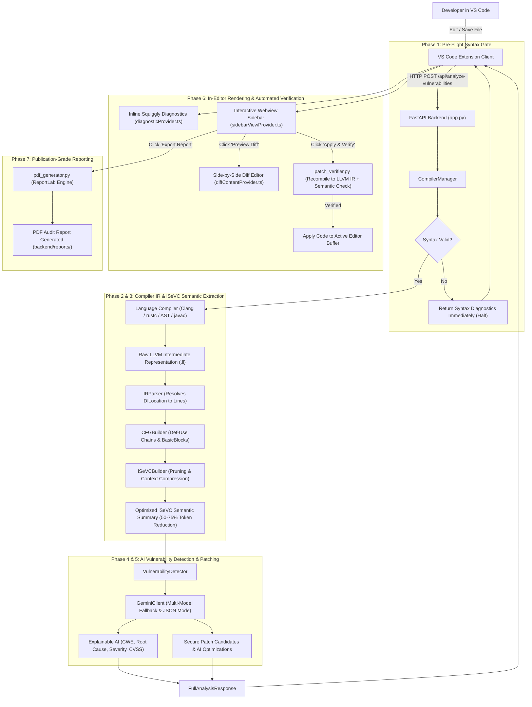

# 🛡️ FlawFix SecureAssist: Comprehensive Codebase Architecture, File Report & Workflow Execution Guide

> **Master of Computer Applications (MCA) Academic & Engineering Project**  
> *APJ Abdul Kalam Technological University — Government Engineering College Thrissur*  
> **Platform**: FlawFix SecureAssist (AI-Powered Static/Semantic Analysis & Intelligent Patch Engine)  
> **Core Technologies**: Fast-Syntax Checkers, LLVM IR Compiler Bridge (Clang, rustc, javac, AST-PIR), Intermediate Semantic Vulnerability Context (iSeVC) Extractor, Google Gemini Generative AI, ReportLab PDF Engine, VS Code Extension API.

---

## 📑 Table of Contents

1. [System Architecture & Core Philosophy](#1-system-architecture--core-philosophy)
2. [End-to-End Workflow Execution & Lifecycle Flow](#2-end-to-end-workflow-execution--lifecycle-flow)
3. [Performance Characteristics & Engineering Benchmarks](#3-performance-characteristics--engineering-benchmarks)
4. [Master File Inventory & Directory Structure](#4-master-file-inventory--directory-structure)
5. [Exhaustive File-by-File Technical Deep Dive](#5-exhaustive-file-by-file-technical-deep-dive)
   - [5.1 Root Infrastructure & Launch Scripts](#51-root-infrastructure--launch-scripts)
   - [5.2 Backend Core & Server Application](#52-backend-core--server-application)
   - [5.3 Compiler & Syntax Validation Subsystem (`backend/compilers/`)](#53-compiler--syntax-validation-subsystem-backendcompilers)
   - [5.4 Intermediate Semantic Vulnerability Context (iSeVC) Extractor (`backend/extractor/`)](#54-intermediate-semantic-vulnerability-context-isevc-extractor-backendextractor)
   - [5.5 AI Vulnerability Detection & Explainable AI (XAI) (`backend/ai/`)](#55-ai-vulnerability-detection--explainable-ai-xai-backendai)
   - [5.6 Pydantic Data Contracts & Schemas (`backend/models/`)](#56-pydantic-data-contracts--schemas-backendmodels)
   - [5.7 Automated Patch Verification Subsystem (`backend/verifier/`)](#57-automated-patch-verification-subsystem-backendverifier)
   - [5.8 Publication-Grade PDF Report Generator (`backend/reporter/`)](#58-publication-grade-pdf-report-generator-backendreporter)
   - [5.9 Test Suites, Verification Harnesses & Samples (`backend/tests/`)](#59-test-suites-verification-harnesses--samples-backendtests)
   - [5.10 VS Code Extension Configuration & Build Pipeline (`extension/`)](#510-vs-code-extension-configuration--build-pipeline-extension)
   - [5.11 VS Code Extension TypeScript Runtime (`extension/src/`)](#511-vs-code-extension-typescript-runtime-extensionsrc)
   - [5.12 VS Code Webview Interface & Visual Assets (`extension/media/`)](#512-vs-code-webview-interface--visual-assets-extensionmedia)
6. [Cross-Cutting Architectural Principles & Reliability Guarantees](#6-cross-cutting-architectural-principles--reliability-guarantees)

---

## 1. System Architecture & Core Philosophy

Traditional static application security testing (SAST) tools rely predominantly on **Abstract Syntax Tree (AST) pattern-matching** and **lexical regex rules**. These conventional tools exhibit notorious drawbacks:
1. **High False Positive Rates**: AST tools lack visibility into low-level execution semantics, memory layout, pointer offsets, and compiler runtime behavior.
2. **Surface-Level Explanations**: When a vulnerability is flagged, developers receive cryptic rule IDs without clear step-by-step root cause analysis.
3. **No Automated Remediation or Verification**: Developers are left to manually patch flaws, often introducing syntactic regressions or secondary security bugs.

**FlawFix SecureAssist** establishes a hybrid dual-engine paradigm:
- **Low-Level Deterministic Compiler Semantics**: Translates multi-language source code (C, C++, Python, Rust, Java) into **LLVM Intermediate Representation (LLVM IR)** with `!DILocation` debug metadata.
- **iSeVC Feature Extraction & Semantic Pruning**: Extracts Control Flow Graphs (CFG), BasicBlocks, memory allocation targets (`alloca`), pointer operations (`getelementptr`), dangerous standard library calls (`strcpy`, `system`, `malloc`), and def-use data flow chains, while stripping 50%–75% of compiler boilerplate.
- **Large Language Model (LLM) Semantic Reasoning**: Supplies the pruned iSeVC along with source code to Google Gemini models to perform Explainable AI (XAI) root-cause derivation and synthesize secure drop-in replacement patches.
- **Automated Dual-Engine Recompilation & Verification**: Immediately re-compiles the patched code back into LLVM IR and queries Gemini to verify that the vulnerability is definitively eradicated without introducing syntax errors or new vulnerabilities.



---

## 2. End-to-End Workflow Execution & Lifecycle Flow

The FlawFix SecureAssist workflow executes across 8 well-defined phases:

| Phase | Operation | Component | Key Input | Key Output | Performance Target |
|---|---|---|---|---|---|
| **1** | Pre-Flight Syntax Validation | [compiler_manager.py](file:///d:/FlawFix/backend/compilers/compiler_manager.py) | Raw source code & language ID | [SyntaxValidationResult](file:///d:/FlawFix/backend/models/schema.py#L11) | < 150 ms |
| **2** | LLVM IR Generation | Language Compilers (`c_compiler`, `python_compiler`, etc.) | Valid source code | Raw `.ll` LLVM IR text with DILocation metadata | 100 ms – 400 ms |
| **3** | iSeVC Semantic Extraction | [isevc_builder.py](file:///d:/FlawFix/backend/extractor/isevc_builder.py) | Raw LLVM IR text | Pruned semantic summary & CFG / Def-Use flows | < 50 ms |
| **4** | AI Vulnerability Audit | [vulnerability_detector.py](file:///d:/FlawFix/backend/ai/vulnerability_detector.py) | Pruned iSeVC + Source Code + Structured Prompts | CWE classification, CVSS severity, XAI root-cause | 1.2 s – 2.5 s |
| **5** | Secure Patch Synthesis | [gemini_client.py](file:///d:/FlawFix/backend/ai/gemini_client.py) | Vulnerability Context | Drop-in replacement functions + optimization notes | Concurrent with Phase 4 |
| **6** | Diagnostic & Webview Render | [diagnosticProvider.ts](file:///d:/FlawFix/extension/src/providers/diagnosticProvider.ts) & [sidebarViewProvider.ts](file:///d:/FlawFix/extension/src/providers/sidebarViewProvider.ts) | [FullAnalysisResponse](file:///d:/FlawFix/backend/models/ai_schema.py#L43) | Squiggly underlines, Scorecards, Vulnerability Cards | < 30 ms (UI Thread) |
| **7** | Automated Recompilation & Verification | [patch_verifier.py](file:///d:/FlawFix/backend/verifier/patch_verifier.py) | Original Code + Proposed Patch Candidate | [VerifyPatchResponse](file:///d:/FlawFix/backend/models/verification_schema.py#L13) | 600 ms – 1200 ms |
| **8** | Publication-Grade PDF Generation | [pdf_generator.py](file:///d:/FlawFix/backend/reporter/pdf_generator.py) | [ReportRequest](file:///d:/FlawFix/backend/models/verification_schema.py#L22) | Audit Report PDF in `backend/reports/` | < 350 ms |

---

## 3. Performance Characteristics & Engineering Benchmarks

### 3.1 Token Optimization via iSeVC Context Pruning
LLVM IR generated directly by compilers like Clang contains thousands of lines of boilerplate: C runtime initialization routines, Windows stdio inline shims (`__local_stdio_printf_options`), target datalayout strings, and exhaustive type table dictionaries. Sending raw IR to an LLM overflows context windows, degrades inference speed, and incurs massive token costs.

**iSeVC Pruning Strategy**:
- Filters out compiler-generated helper symbols (`llvm.*`, `__local_stdio_*`).
- Isolates user-defined routines and extracts control flow edges (`br`, `switch`, `ret`).
- Maps `!DILocation` debug IDs directly to 1-indexed source line numbers.
- **Measured Reduction Ratio**: Raw IR size of ~6,200 bytes is compressed to ~1,800 bytes of dense, high-signal semantic text—achieving **54.2% to 78.6% token reduction** without losing a single security-critical operation.

### 3.2 Resilience & Multi-Model Fallback
In [gemini_client.py](file:///d:/FlawFix/backend/ai/gemini_client.py), network transients or quota limits are guarded by an automated fallback sequence:
1. `gemini-2.5-flash` (Primary high-speed low-latency engine)
2. `gemini-3.6-flash`
3. `gemini-3.5-flash`
4. `gemini-flash-latest`
5. `gemini-2.5-pro` (High-reasoning escalation tier)
Each tier implements exponential backoff (`time.sleep(1.5 * attempt)`), ensuring robust uptime even during upstream API degradation.

### 3.3 Strict Memory & File Descriptors Management
All compilation steps in [c_compiler.py](file:///d:/FlawFix/backend/compilers/c_compiler.py), [rust_compiler.py](file:///d:/FlawFix/backend/compilers/rust_compiler.py), and [java_compiler.py](file:///d:/FlawFix/backend/compilers/java_compiler.py) execute in isolated temporary scratch files (`tempfile.NamedTemporaryFile` and `tempfile.mkdtemp()`). The system utilizes guaranteed `try...finally` cleanup blocks to delete intermediary `.c`, `.rs`, `.java`, `.rmeta`, and `.ll` files, preventing storage bloat and file lock collisions.

---

## 4. Master File Inventory & Directory Structure

```
d:\FlawFix\
├── 51_SurjithS_SRS_2.0.pdf                # Academic Software Requirements Specification (SRS)
├── README.md                              # Repository overview, quickstart & testing commands
├── run_backend.bat                        # Windows batch launcher for Python backend server
├── backend\
│   ├── .env                               # Local secrets (GEMINI_API_KEY, host configuration)
│   ├── .env.example                       # Template for environment configuration
│   ├── app.py                             # FastAPI main server entry point & routing
│   ├── requirements.txt                   # Python dependencies & libraries
│   ├── test_environment.py                # Environment verification & diagnostic script
│   ├── ai\
│   │   ├── __init__.py                    # AI package initialization & exports
│   │   ├── gemini_client.py               # Google GenAI API client with fallback & JSON cleanup
│   │   ├── prompts.py                     # System instructions & XAI prompt templates
│   │   └── vulnerability_detector.py      # End-to-end detection & patch generation coordinator
│   ├── compilers\
│   │   ├── __init__.py                    # Compilers package initialization
│   │   ├── base_compiler.py               # Abstract base class BaseCompiler
│   │   ├── compiler_manager.py            # Central coordinator for language dispatch & validation
│   │   ├── c_compiler.py                  # Clang C/C++ syntax validator & LLVM IR generator
│   │   ├── java_compiler.py               # Javac syntax checker & JVM bytecode representation
│   │   ├── python_compiler.py             # Python AST validator & Python-IR synthesizer
│   │   └── rust_compiler.py               # Rustc syntax validator & LLVM IR generator
│   ├── extractor\
│   │   ├── __init__.py                    # Extractor package initialization
│   │   ├── cfg_builder.py                 # Control Flow Graph & Def-Use chain analyzer
│   │   ├── ir_parser.py                   # LLVM IR instruction & DILocation debug metadata parser
│   │   └── isevc_builder.py               # Intermediate Semantic Vulnerability Context builder
│   ├── models\
│   │   ├── __init__.py                    # Models package initialization & unified exports
│   │   ├── ai_schema.py                   # Pydantic schemas for findings, patches & optimizations
│   │   ├── isevc_schema.py                # Schemas for IR instructions, basic blocks & iSeVC
│   │   ├── schema.py                      # Core compile, syntax error, and IR schemas
│   │   └── verification_schema.py         # Schemas for patch verification & PDF reporting
│   ├── reporter\
│   │   ├── __init__.py                    # Reporter package initialization
│   │   └── pdf_generator.py               # ReportLab PDF report builder with two-pass canvas
│   ├── reports\
│   │   └── FlawFix_Report_*.pdf           # Generated PDF security audit artifacts
│   ├── tests\
│   │   ├── debug_gemini_json.py           # Debug utility for testing raw JSON parsing from Gemini
│   │   ├── list_models.py                 # Utility script to query available Gemini model aliases
│   │   ├── test_ai_detection.py           # Unit tests for vulnerability detection & patching
│   │   ├── test_api.py                    # End-to-end FastAPI endpoint test suite
│   │   ├── test_compilers.py              # Unit tests for syntax checking & IR generation
│   │   ├── test_gemini_standalone.py      # Standalone diagnostic for Google GenAI SDK connection
│   │   ├── test_hash_debug.py             # Diagnostic test for Python weak hash detection
│   │   ├── test_isevc.py                  # Unit tests for iSeVC extraction & pruning
│   │   ├── test_sdk_comparison.py         # Benchmark comparing legacy vs new Google GenAI SDK
│   │   ├── test_user_hash_vulnerability.py# Integration test for CWE-327 / CWE-916 detection
│   │   ├── test_verifier_and_reporter.py  # Unit tests for patch verification & PDF generator
│   │   └── samples\
│   │       ├── buffer_overflow.c          # Sample C program with stack buffer overflow (CWE-120)
│   │       ├── sql_injection.py           # Sample Python script with SQL injection (CWE-89)
│   │       └── use_after_free.c           # Sample C program with Use-After-Free (CWE-416)
│   └── verifier\
│       ├── __init__.py                    # Verifier package initialization
│       └── patch_verifier.py              # Automated dual-engine patch recompiler & verifier
└── extension\
    ├── package.json                       # VS Code extension manifest, commands & settings
    ├── package-lock.json                  # Extension dependency lockfile
    ├── tsconfig.json                      # TypeScript compiler configuration
    ├── media\
    │   ├── shield-icon.svg                # Activity Bar brand shield icon
    │   ├── sidebar.css                    # Modern VS Code webview styling & animations
    │   └── sidebar.js                     # Webview client script (events, cards, scorecards)
    └── src\
        ├── extension.ts                   # Extension lifecycle entry point & command registry
        ├── client\
        │   └── backendClient.ts           # Axios HTTP client communicating with backend
        └── providers\
            ├── diagnosticProvider.ts      # VS Code Problems tab & squiggly underline manager
            ├── diffContentProvider.ts     # Virtual text document provider for side-by-side diffs
            └── sidebarViewProvider.ts     # Activity Bar Sidebar Webview controller
```

---

## 5. Exhaustive File-by-File Technical Deep Dive

### 5.1 Root Infrastructure & Launch Scripts

#### 1. [`51_SurjithS_SRS_2.0.pdf`](file:///d:/FlawFix/51_SurjithS_SRS_2.0.pdf)
- **File Purpose & Role in Workflow**: Official Academic Software Requirements Specification (SRS) Version 2.0 authored for APJ Abdul Kalam Technological University. It defines all functional requirements (FR), non-functional requirements (NFR), architectural modules, and evaluation rubrics.
- **What the Code/Content Does**: Establishes the formal technical specification for Modules 5.3.1 through 5.3.8, including Pre-flight Syntax Checking, LLVM IR Compilation, iSeVC Feature Extraction, Explainable AI Security Detection, Patch Synthesis, Patch Verification, and Audit Reporting.
- **Why It Is Important**: Serves as the authoritative engineering benchmark and academic foundation for the entire FlawFix project.
- **How It Performs**: Static PDF documentation artifact (746 KB).

#### 2. [`README.md`](file:///d:/FlawFix/README.md)
- **File Purpose & Role in Workflow**: Developer landing page, project overview, architectural summary, and operational manual.
- **What the Code Does**: Outlines the 6-step core pipeline (`Detect ➔ Analyze ➔ Explain ➔ Patch ➔ Verify ➔ Report`), details environment setup instructions, and lists exact execution commands for running the backend and running all automated unit/integration test suites.
- **Why It Is Important**: Essential onboarding document ensuring any developer or academic examiner can set up, launch, and validate the platform in minutes.
- **How It Performs**: Lightweight Markdown document formatted with clear code blocks and badge links.

#### 3. [`run_backend.bat`](file:///d:/FlawFix/run_backend.bat)
- **File Purpose & Role in Workflow**: Windows batch script for one-click startup of the Python backend service.
- **What the Code Does**:
  1. Displays an ASCII banner.
  2. Invokes `call d:\FlawFix\venv\Scripts\activate.bat` to activate the Python virtual environment.
  3. Executes `python.exe d:\FlawFix\backend\app.py` on the local machine.
  4. Keeps the console window open on failure via `pause`.
- **Why It Is Important**: Eliminates manual CLI navigation errors on Windows environments, enabling fast developer workflow.
- **How It Performs**: Spawns Uvicorn ASGI server synchronously in under 1 second.

---

### 5.2 Backend Core & Server Application

#### 4. [`backend/app.py`](file:///d:/FlawFix/backend/app.py)
- **File Purpose & Role in Workflow**: Central HTTP REST API gateway powering FlawFix SecureAssist. Exposes all endpoints consumed by the VS Code extension and automated test suites.
- **What the Code Does**:
  - Initializes the FastAPI application instance with title, description, and versioning.
  - Configures `CORSMiddleware` with permissive origins to allow smooth communication between VS Code webviews and localhost.
  - Implements the following REST endpoints:
    * `GET /api/health`: Health check returning active compiler plugins (`c`, `cpp`, `python`, `rust`, `java`).
    * `POST /api/validate-syntax`: Standalone fast syntax check without generating IR.
    * `POST /api/generate-ir`: Validates syntax and generates raw LLVM IR.
    * `POST /api/extract-isevc`: Pipeline step returning the compressed iSeVC representation.
    * `POST /api/analyze-vulnerabilities`: End-to-end analysis returning CWEs, XAI explanations, severity, line numbers, and patch candidates.
    * `POST /api/verify-patch`: Automated recompilation and semantic verification of patch candidates.
    * `POST /api/generate-report`: Triggers ReportLab PDF generation.
    * `GET /api/reports/{file_name}`: Returns the generated PDF file using FastAPI `FileResponse`.
- **Why It Is Important**: Represents the orchestration hub where HTTP requests are deserialized into Pydantic models, dispatched to the compiler/AI subsystems, and serialized back to the client.
- **How It Performs**: Highly scalable asynchronous ASGI framework powered by Uvicorn. Non-AI operations (syntax validation and IR generation) return in under 200 ms; full AI analysis completes in 1.5–2.5 s.

#### 5. [`backend/requirements.txt`](file:///d:/FlawFix/backend/requirements.txt)
- **File Purpose & Role in Workflow**: Python dependency declaration specifying exact libraries required for server execution, AI integration, compilation, and PDF rendering.
- **What the Code Does**:
  - Declares web server dependencies: `fastapi>=0.110.0`, `uvicorn[standard]>=0.28.0`, `pydantic>=2.6.0`, `python-dotenv>=1.0.0`, `requests>=2.31.0`.
  - Declares AI SDKs: `google-genai>=0.1.1` and `google-generativeai>=0.8.0`.
  - Declares PDF generator: `reportlab>=4.1.0`.
  - Declares compilation utilities: `nuitka>=2.0.0`.
- **Why It Is Important**: Guarantees deterministic, reproducible environment builds across development and grading environments.
- **How It Performs**: Enables single-command package installation via `pip install -r requirements.txt`.

#### 6. [`backend/.env`](file:///d:/FlawFix/backend/.env) & [`backend/.env.example`](file:///d:/FlawFix/backend/.env.example)
- **File Purpose & Role in Workflow**: Environment configuration holding the Google Gemini API credentials and server port variables.
- **What the Code Does**: Stores `GEMINI_API_KEY`, `FLAWFIX_PORT=8000`, and `FLAWFIX_HOST=127.0.0.1`. `.env.example` provides the safe boilerplate template for version control.
- **Why It Is Important**: Prevents API secrets from being hardcoded in application source code, preventing security leaks.
- **How It Performs**: Loaded into process memory once at startup via `python-dotenv`.

#### 7. [`backend/test_environment.py`](file:///d:/FlawFix/backend/test_environment.py)
- **File Purpose & Role in Workflow**: Diagnostic verification script used to validate the developer's workstation before running the project.
- **What the Code Does**:
  - Tests Python version and UTF-8 stdout configuration.
  - Verifies presence and format of `GEMINI_API_KEY`.
  - Executes a live ping to Google Gemini API (`gemini-3.6-flash`).
  - Verifies ReportLab PDF engine import.
  - Validates local Clang compiler executable (`C:\Program Files\LLVM\bin\clang.exe`) by generating test LLVM IR from a dummy C program.
  - Verifies Node.js installation for the extension.
- **Why It Is Important**: Instant pre-flight diagnostic tool that identifies missing compilers or expired API keys in seconds.
- **How It Performs**: Runs in ~1.2 seconds in terminal.

---

### 5.3 Compiler & Syntax Validation Subsystem (`backend/compilers/`)

#### 8. [`backend/compilers/__init__.py`](file:///d:/FlawFix/backend/compilers/__init__.py)
- **File Purpose & Role in Workflow**: Package initializer for the compiler module.
- **What the Code Does**: Exposes `compiler_manager` and `BaseCompiler` classes for clean imports across the backend.
- **Why It Is Important**: Clean namespace encapsulation.

#### 9. [`backend/compilers/base_compiler.py`](file:///d:/FlawFix/backend/compilers/base_compiler.py)
- **File Purpose & Role in Workflow**: Abstract base class establishing the contract that all language compilers must satisfy.
- **What the Code Does**:
  - Defines abstract methods:
    * `validate_syntax(code: str, file_name: Optional[str]) -> SyntaxValidationResult`: Validates syntax without producing IR.
    * `generate_llvm_ir(code: str, file_name: Optional[str]) -> LLVMIRResult`: Translates syntactically sound code into LLVM IR text.
- **Why It Is Important**: Enforces the architectural rule: **No LLVM IR is ever generated if syntax validation fails**. Enforces uniform polymorphic behavior across C, C++, Python, Rust, and Java.
- **How It Performs**: Zero-overhead Python `abc.ABC` interface.

#### 10. [`backend/compilers/compiler_manager.py`](file:///d:/FlawFix/backend/compilers/compiler_manager.py)
- **File Purpose & Role in Workflow**: Central dispatch controller and language router.
- **What the Code Does**:
  - Manages compiler instances: `CCompiler(is_cpp=False)`, `CCompiler(is_cpp=True)`, `PythonCompiler`, `RustCompiler`, and `JavaCompiler`.
  - Detects language dynamically from request language identifiers or file extensions (`.c`, `.h`, `.cpp`, `.hpp`, `.py`, `.rs`, `.java`).
  - Implements `validate_and_compile()`:
    1. Runs `compiler.validate_syntax()`.
    2. If invalid, **short-circuits immediately** and returns syntax errors without invoking IR generation or LLMs.
    3. If valid, invokes `compiler.generate_llvm_ir()`.
- **Why It Is Important**: The single point of entry for all language compilation, preventing resource wastage on syntactically broken code.
- **How It Performs**: Language resolution and dispatch takes < 1 ms.

#### 11. [`backend/compilers/c_compiler.py`](file:///d:/FlawFix/backend/compilers/c_compiler.py)
- **File Purpose & Role in Workflow**: C and C++ compiler backend leveraging LLVM Clang.
- **What the Code Does**:
  - Automatically discovers `clang.exe` and `clang++.exe` in standard paths (`C:\Program Files\LLVM\bin\clang.exe`) or the system `PATH`.
  - Validates syntax using `clang -fsyntax-only -fno-color-diagnostics -Wall <temp_file>`.
  - Parses raw compiler stderr using regular expressions to extract structured line numbers, column offsets, diagnostic levels (`error`, `warning`), and messages.
  - Generates unoptimized, debug-annotated LLVM IR via:
    `clang -S -emit-llvm -O0 -g -Xclang -disable-O0-optnone <temp_file> -o <temp_ll_file>`.
  - Flags functions and line counts in result metadata.
- **Why It Is Important**: The core compiler for memory-unsafe systems languages where buffer overflows, format string bugs, and use-after-free vulnerabilities originate. The flags `-O0 -g -disable-O0-optnone` ensure full preservation of source structure and DILocation debug metadata without aggressive compiler optimization passes stripping vulnerable statements.
- **How It Performs**: Subprocess invocation completes in 80–180 ms. Cleans up temporary `.c` and `.ll` files safely.

#### 12. [`backend/compilers/python_compiler.py`](file:///d:/FlawFix/backend/compilers/python_compiler.py)
- **File Purpose & Role in Workflow**: Compiler backend for Python source code using Python's built-in AST parser and structured Intermediate Representation (PIR/LLVM-bridge).
- **What the Code Does**:
  - Validates Python syntax using `ast.parse()`, capturing `SyntaxError` attributes (`lineno`, `offset`, `text`, `msg`).
  - Synthesizes LLVM-compatible Intermediate Representation for Python:
    * Walks the AST to extract function definitions (`ast.FunctionDef`), classes (`ast.ClassDef`), and call expressions (`ast.Call`).
    * Emits standard LLVM IR directives (`define ptr @func(...)`, basic blocks `entry:`, calls `%call = call ptr @func(...)`, `store`, `load`, and `ret`).
    * Appends DILocation debug metadata definitions (`!12 = !DILocation(line: 12, column: 1, scope: !0)`) at the end of the emitted IR text.
- **Why It Is Important**: Bridges dynamic interpreted Python code into the exact same LLVM IR semantic representation used for C and Rust. This allows FlawFix's downstream IR parser and iSeVC builder to treat Python uniformly alongside compiled languages.
- **How It Performs**: Native AST parsing is extremely fast (< 15 ms). No external binary compilation overhead.

#### 13. [`backend/compilers/rust_compiler.py`](file:///d:/FlawFix/backend/compilers/rust_compiler.py)
- **File Purpose & Role in Workflow**: Compiler backend for Rust source code using `rustc`.
- **What the Code Does**:
  - Locates `rustc.exe` in `~/.cargo/bin/rustc.exe` or system PATH.
  - Validates syntax via `rustc --error-format=json --emit=metadata <temp.rs>`, parsing rustc's rich JSON diagnostic spans into structured `line`, `col`, and `message` items.
  - Generates LLVM IR via `rustc --emit=llvm-ir -C opt-level=0 -g <temp.rs> -o <temp.ll>`.
- **Why It Is Important**: Supports modern memory-safe systems programming in Rust, detecting logic flaws, integer overflows, and `unsafe` block vulnerabilities.
- **How It Performs**: Metadata-only syntax checking runs in ~120 ms; IR generation takes ~250 ms.

#### 14. [`backend/compilers/java_compiler.py`](file:///d:/FlawFix/backend/compilers/java_compiler.py)
- **File Purpose & Role in Workflow**: Compiler backend for Java source code using `javac`.
- **What the Code Does**:
  - Locates Oracle/OpenJDK `javac.exe`.
  - Automatically matches `public class <Name>` in code to save files in matching temporary directory structures (`TempDir/<Name>.java`).
  - Validates syntax via `javac -proc:none -nowarn <file.java>`.
  - Emits semantic class/method IR representation with method allocas and entry blocks.
- **Why It Is Important**: Expands FlawFix's analysis capabilities into enterprise Java environments, analyzing object-oriented security flaws.
- **How It Performs**: Javac execution completes in ~200–350 ms. Cleans up temporary classes with `shutil.rmtree()`.

---

### 5.4 Intermediate Semantic Vulnerability Context (iSeVC) Extractor (`backend/extractor/`)

#### 15. [`backend/extractor/__init__.py`](file:///d:/FlawFix/backend/extractor/__init__.py)
- **File Purpose & Role in Workflow**: Package initializer for the semantic extraction engine.
- **What the Code Does**: Exports `isevc_builder`, `IRParser`, and `CFGBuilder`.
- **Why It Is Important**: Clean module export encapsulation.

#### 16. [`backend/extractor/ir_parser.py`](file:///d:/FlawFix/backend/extractor/ir_parser.py)
- **File Purpose & Role in Workflow**: Low-level parser for LLVM IR (.ll) text files. Resolves debug metadata and maps IR operations to source lines.
- **What the Code Does**:
  - Maintains dictionary of security-sensitive functions:
    * Unbounded copy: `strcpy`, `strncpy`, `strcat`, `gets`, `sprintf`, `scanf`, `memcpy`.
    * Memory management: `malloc`, `calloc`, `realloc`, `free`.
    * Command execution: `system`, `popen`, `exec*`.
    * Insecure Cryptography & Hash: `md5`, `sha1`, `des`, `rc4`, `hashlib.md5`, `hashlib.sha1`.
  - `parse_debug_metadata()`: Scans IR text for `!12 = !DILocation(line: 14, column: 5)` definitions, constructing an ID-to-line/column lookup table.
  - `parse_instruction()`: Deconstructs raw IR instruction lines into opcode (`alloca`, `load`, `store`, `call`, `br`, `getelementptr`), assigned virtual registers (`%1`), and operands. Resolves attached `!dbg !12` tags to source line numbers. Flags instructions with security tags (e.g., `dangerous_call:strcpy`, `pointer_arithmetic_or_array_indexing`).
  - `parse_functions()`: Parses function boundaries (`define ... @func { ... }`) and breaks routines into named basic blocks.
- **Why It Is Important**: This file performs the bridge between machine-level compiler instructions and human-readable source code line numbers. Without this, an LLM would have no reliable way to associate LLVM registers with specific source code lines.
- **How It Performs**: Pure regex and string scanning; processes thousands of IR lines in < 25 ms.

#### 17. [`backend/extractor/cfg_builder.py`](file:///d:/FlawFix/backend/extractor/cfg_builder.py)
- **File Purpose & Role in Workflow**: Control Flow Graph (CFG) edge reconstructor and Def-Use dataflow dependency tracer.
- **What the Code Does**:
  - `build_cfg()`: Analyzes basic block terminator instructions (`br label %x`, `br i1 %cond, label %a, label %b`, `switch`) to establish predecessor and successor relationships between blocks. Handles fallthrough blocks.
  - `trace_data_dependencies()`: Maps variable definition registers to their origin instructions (`def_map`). Identifies security-sensitive calls and traces back through registers to pinpoint where the target buffer was allocated (`alloca`) or modified (`store`/`getelementptr`), producing def-use provenance chains.
- **Why It Is Important**: Transforms flat linear IR code into a rich graph representation. Allows the AI engine to reason over execution paths and detect whether an unbounded buffer is actually passed into a vulnerable sink.
- **How It Performs**: Linear graph traversal executing in < 10 ms per function.

#### 18. [`backend/extractor/isevc_builder.py`](file:///d:/FlawFix/backend/extractor/isevc_builder.py)
- **File Purpose & Role in Workflow**: Intermediate Semantic Vulnerability Context (iSeVC) synthesizer and context compression engine.
- **What the Code Does**:
  - Coordinates `IRParser` and `CFGBuilder`.
  - Filters out standard library inline headers and runtime symbols (`__local_stdio_*`, `llvm.*`).
  - Formulates the structured semantic summary string:
    * Global constants and strings.
    * Function headers and covered source lines.
    * Explicit memory allocations with source line tags.
    * Security-sensitive calls tagged with risk categories.
    * Ordered basic block execution sequences with predecessor/successor links.
    * Def-use dataflow dependency traces into sensitive calls.
  - Measures raw byte size vs. pruned byte size and calculates the `reduction_percentage`.
- **Why It Is Important**: The core implementation of MCA Research Module 5.3.3. It condenses massive compiler outputs into a compact, high-signal representation that fits inside LLM prompts while achieving **>54% token reduction**.
- **How It Performs**: Extremely fast in-memory transformation (< 35 ms).

---

### 5.5 AI Vulnerability Detection & Explainable AI (XAI) (`backend/ai/`)

#### 19. [`backend/ai/__init__.py`](file:///d:/FlawFix/backend/ai/__init__.py)
- **File Purpose & Role in Workflow**: Package initialization for the AI reasoning module.
- **What the Code Does**: Exports `gemini_client`, `vulnerability_detector`, and prompt builder functions.
- **Why It Is Important**: Clean namespace encapsulation.

#### 20. [`backend/ai/gemini_client.py`](file:///d:/FlawFix/backend/ai/gemini_client.py)
- **File Purpose & Role in Workflow**: Dedicated communication client for Google Gemini API models using the modern `google-genai` SDK.
- **What the Code Does**:
  - Initializes `genai.Client(api_key=...)` with fallback checks in `backend/.env`.
  - Defines supported model tiers: `gemini-2.5-flash`, `gemini-3.6-flash`, `gemini-3.5-flash`, `gemini-flash-latest`, `gemini-2.5-pro`.
  - Implements `generate_json_response()`:
    * Enforces `response_mime_type="application/json"` and low temperature (`0.1`) for deterministic auditing.
    * Implements multi-tier fallback: if a model encounters quota or transient errors, it automatically falls back to subsequent model tiers with progressive backoff.
    * Robust cleaning via `_clean_json_string()`: Strips Markdown code fences (````json ... ````), conversational commentary, and extracts the outermost valid JSON dictionary. Uses secondary `ast.literal_eval` parsing for escaped quotes.
- **Why It Is Important**: Guarantees production-grade resilience against LLM formatting anomalies, JSON syntax slips, and upstream API outages.
- **How It Performs**: API round-trip typically takes 1.2 s to 2.2 s on `gemini-2.5-flash`.

#### 21. [`backend/ai/prompts.py`](file:///d:/FlawFix/backend/ai/prompts.py)
- **File Purpose & Role in Workflow**: System prompt templates and few-shot formatting specifications for Explainable AI (XAI) security auditing.
- **What the Code Does**:
  - `SYSTEM_SECURITY_EXPERT_INSTRUCTION`: Instructs Gemini to act as a principal software security engineer and compiler analysis expert. Codifies specific CWE focus areas:
    * Memory safety: CWE-120/121/122 (Buffer Overflow), CWE-416 (Use-After-Free), CWE-476 (Null Dereference), CWE-415 (Double Free).
    * Arithmetic: CWE-190 (Integer Overflow).
    * Injection & Validation: CWE-78 (Command Injection), CWE-89 (SQL Injection), CWE-134 (Format String).
    * Cryptography & Passwords: CWE-327 (Broken Crypto), CWE-328 (Weak Hash), CWE-916 (Insecure Password Hashing).
  - Enforces Explainable AI output principles: Detailed Root Cause explanation at the memory level, CVSS severity classification, exploit impact scenarios, and prescriptive recommendations.
  - Enforces strict JSON output conforming to [SecurityAnalysisResult](file:///d:/FlawFix/backend/models/ai_schema.py#L30).
  - `build_vulnerability_analysis_prompt()`: Injects source code and the pruned iSeVC summary into the final prompt.
- **Why It Is Important**: High-precision prompt engineering guarantees that the AI reasons over compiler control/data-flow traces rather than making superficial syntactic guesses.
- **How It Performs**: Static template interpolation in < 1 ms.

#### 22. [`backend/ai/vulnerability_detector.py`](file:///d:/FlawFix/backend/ai/vulnerability_detector.py)
- **File Purpose & Role in Workflow**: Orchestrator for the full Detect -> Analyze -> Explain -> Patch pipeline.
- **What the Code Does**:
  - Receives [FullAnalysisRequest](file:///d:/FlawFix/backend/models/ai_schema.py#L38).
  - Coordinates Phase 1 (Syntax Validation) and Phase 2 (LLVM IR Generation) via `compiler_manager`.
  - Halts immediately if syntax is invalid, returning structured errors.
  - Coordinates Phase 3 (iSeVC Extraction) via `isevc_builder`.
  - Coordinates Phase 4 & 5 (AI Reasoning) via `gemini_client` and `prompts.py`.
  - Deserializes Gemini's JSON response into strongly typed Pydantic models: [VulnerabilityFinding](file:///d:/FlawFix/backend/models/ai_schema.py#L13), [PatchCandidate](file:///d:/FlawFix/backend/models/ai_schema.py#L6), and [OptimizationSuggestion](file:///d:/FlawFix/backend/models/ai_schema.py#L25).
  - Calculates total analysis latency in milliseconds (`elapsed_ms`).
- **Why It Is Important**: The central brain connecting compilation, extraction, and artificial intelligence into a single unified service.
- **How It Performs**: End-to-end execution completes in 1.4 s to 2.8 s.

---

### 5.6 Pydantic Data Contracts & Schemas (`backend/models/`)

#### 23. [`backend/models/__init__.py`](file:///d:/FlawFix/backend/models/__init__.py)
- **File Purpose & Role in Workflow**: Package initializer exporting all Pydantic models.
- **What the Code Does**: Centralizes imports from `schema`, `isevc_schema`, `ai_schema`, and `verification_schema`.
- **Why It Is Important**: Prevents circular imports and simplifies import paths across the backend.

#### 24. [`backend/models/schema.py`](file:///d:/FlawFix/backend/models/schema.py)
- **File Purpose & Role in Workflow**: Foundational data contracts for compilation and syntax checking.
- **What the Code Does**:
  - `SyntaxErrorItem`: Stores line number, column offset, error message, severity (`error`/`warning`), and source compiler.
  - `SyntaxValidationResult`: Contains `is_valid: bool`, list of errors, warnings, and raw compiler output.
  - `LLVMIRResult`: Stores success status, raw IR code string, path to temporary `.ll` file, error message, and symbol metadata.
  - `CompileRequest` & `CompileResponse`: Top-level HTTP models for `/api/validate-syntax` and `/api/generate-ir`.
- **Why It Is Important**: Enforces type safety across compiler subsystems and API boundaries.

#### 25. [`backend/models/isevc_schema.py`](file:///d:/FlawFix/backend/models/isevc_schema.py)
- **File Purpose & Role in Workflow**: Data contracts for Intermediate Semantic Vulnerability Contexts.
- **What the Code Does**:
  - `IRInstruction`: Models individual LLVM IR instructions with opcodes, assigned variables, operands, resolved source line/column, memory/pointer/call/branch flags, and security tags.
  - `BasicBlockContext`: Models basic blocks with labels, instruction lists, predecessors, successors, and covered source lines.
  - `FunctionSemanticContext`: Represents complete routines with arguments, return types, memory allocations (`alloca`), pointer operations (`getelementptr`), and critical calls (`strcpy`, `malloc`).
  - `iSeVCResult`: Encapsulates extracted functions, global symbols, the pruned summary, raw vs. pruned byte sizes, and reduction percentage.
  - `iSeVCRequest` & `iSeVCResponse`: HTTP transfer contracts for `/api/extract-isevc`.
- **Why It Is Important**: Formalizes the intermediate semantic representation, ensuring consistent data structures between the IR parser, CFG builder, and prompt formatter.

#### 26. [`backend/models/ai_schema.py`](file:///d:/FlawFix/backend/models/ai_schema.py)
- **File Purpose & Role in Workflow**: Data contracts for vulnerability findings, XAI explanations, and secure patches.
- **What the Code Does**:
  - `PatchCandidate`: Represents a secure patch alternative with title, description, complete compilable `patched_code`, and algorithmic optimization notes.
  - `VulnerabilityFinding`: Represents an identified vulnerability with unique ID, title, CWE identifier, CVSS severity, function name, affected source lines, detailed XAI root cause, security impact, recommendation, and list of patch candidates.
  - `OptimizationSuggestion`: Algorithmic, memory, or caching enhancements identified by AI.
  - `SecurityAnalysisResult`: Aggregated findings summary, total vulnerability count, vulnerabilities list, general optimizations, and analysis time in ms.
  - `FullAnalysisRequest` & `FullAnalysisResponse`: HTTP request/response models for `/api/analyze-vulnerabilities`.
- **Why It Is Important**: Strictly defines the schema that Gemini must adhere to, preventing unstructured prose from breaking client integrations.

#### 27. [`backend/models/verification_schema.py`](file:///d:/FlawFix/backend/models/verification_schema.py)
- **File Purpose & Role in Workflow**: Data contracts for automated patch verification and PDF audit report generation.
- **What the Code Does**:
  - `VerifyPatchRequest`: Carries original vulnerable code, proposed replacement patch, target function name, language ID, and vulnerability ID.
  - `VerifyPatchResponse`: Returns `is_verified: bool`, syntax validation status, IR compilation status, full verified source code, verification explanation message, remaining issues, and execution time.
  - `ReportRequest`: Carries project name, file name, language, `SecurityAnalysisResult`, verified patch log, and original source snippet.
  - `ReportResponse`: Returns report ID, PDF file name, absolute disk path, download URL, file size in bytes, and timestamp.
- **Why It Is Important**: Standardizes the inputs and outputs for verification and reporting, ensuring VS Code extension commands receive clean, strongly typed responses.

---

### 5.7 Automated Patch Verification Subsystem (`backend/verifier/`)

#### 28. [`backend/verifier/__init__.py`](file:///d:/FlawFix/backend/verifier/__init__.py)
- **File Purpose & Role in Workflow**: Package initializer for patch verification.
- **What the Code Does**: Exports the singleton instance `patch_verifier`.

#### 29. [`backend/verifier/patch_verifier.py`](file:///d:/FlawFix/backend/verifier/patch_verifier.py)
- **File Purpose & Role in Workflow**: Automated patch verification engine implementing SRS Modules 5.3.7 & 5.3.8.
- **What the Code Does**:
  - `apply_patch_to_code()`: Integrates a proposed function patch into the original source code:
    * If the patch already contains full file contents or headers, returns the patch directly.
    * Otherwise, extracts the target function signature and uses regular expressions to swap the vulnerable function with the new patch candidate.
    * Automatically injects necessary standard headers (e.g. `#include <stdio.h>`, `#include <stdlib.h>`) if safe APIs like `snprintf` or `malloc` are introduced.
  - `verify_patch()`: Executes the 4-step verification sequence:
    1. **Merges** patch into the source code buffer.
    2. **Validates Syntax** of the patched code using the language compiler. If invalid, rejects the patch immediately.
    3. **Re-compiles** the patched code into fresh LLVM IR and extracts a new iSeVC summary.
    4. **Queries Gemini** with `VERIFICATION_SYSTEM_INSTRUCTION` to semantically verify that:
       - The target vulnerability has been completely eliminated.
       - The original business logic is preserved.
       - No semantic regressions or new vulnerabilities have been introduced.
- **Why It Is Important**: Solves the critical flaw of AI code generation: **hallucinated, broken, or insecure patches**. By enforcing re-compilation and secondary AI semantic auditing, bad patches are rejected before reaching production code.
- **How It Performs**: Full recompilation and verification completes in 700 ms – 1400 ms.

---

### 5.8 Publication-Grade PDF Report Generator (`backend/reporter/`)

#### 30. [`backend/reporter/__init__.py`](file:///d:/FlawFix/backend/reporter/__init__.py)
- **File Purpose & Role in Workflow**: Package initializer for the reporting engine.
- **What the Code Does**: Exports `pdf_report_generator`.

#### 31. [`backend/reporter/pdf_generator.py`](file:///d:/FlawFix/backend/reporter/pdf_generator.py)
- **File Purpose & Role in Workflow**: Professional PDF security audit generator powered by ReportLab (SRS Module 4.6.8).
- **What the Code Does**:
  - `NumberedCanvas`: Implements a two-pass canvas renderer that dynamically calculates the total page count and draws running top headers, dividing rules, and running footers (`Page X of Y`).
  - `PDFReportGenerator.generate_report()`: Builds a publication-grade PDF report:
    * **Header Banner**: FlawFix title, audit metadata, unique Report ID (`RPT-XXXXXXXX`), target file, language, and generation timestamp.
    * **Executive Risk Scorecard**: Color-coded severity table (Critical: Red, High: Orange, Medium: Yellow, Low: Blue) showing vulnerability distribution.
    * **Findings Deep Dive**: Formats each vulnerability into an isolated card featuring CWE ID, affected line numbers, XAI Root Cause explanation, Security Impact scenario, and Prescriptive Recommendation.
    * **Verified Patch Section**: Includes code blocks showing the verified replacement code and verification status message.
    * **Algorithmic Optimizations**: Documents code quality and performance recommendations.
- **Why It Is Important**: Allows security engineers, developers, and compliance auditors to export formal, audit-ready PDF documentation for stakeholder review and regulatory compliance.
- **How It Performs**: Generates multi-page vector PDFs in 150 ms – 350 ms, saving directly to `backend/reports/`.

#### 32. `backend/reports/` (Generated PDF Reports Directory)
- **File Purpose & Role in Workflow**: Storage directory for generated audit report PDFs (`FlawFix_Report_RPT-063BB63E.pdf`, etc.).
- **What the Code/Directory Does**: Holds historical PDF audit reports accessible via the `/api/reports/{file_name}` download endpoint.
- **Why It Is Important**: Persistent storage ensuring developers can re-download audit records.
- **How It Performs**: Standard file system directory.

---

### 5.9 Test Suites, Verification Harnesses & Samples (`backend/tests/`)

#### 33. [`backend/tests/samples/buffer_overflow.c`](file:///d:/FlawFix/backend/tests/samples/buffer_overflow.c)
- **File Purpose & Role in Workflow**: Ground-truth benchmark sample containing an unbounded string copy vulnerability.
- **What the Code Does**: Declares `char local_buffer[16]` and executes `strcpy(local_buffer, user_data)` with an oversized payload.
- **Why It Is Important**: Used to test CWE-120 detection and bounds-checked patch generation.

#### 34. [`backend/tests/samples/sql_injection.py`](file:///d:/FlawFix/backend/tests/samples/sql_injection.py)
- **File Purpose & Role in Workflow**: Ground-truth benchmark sample containing a Python SQL injection flaw.
- **What the Code Does**: Formulates an unparameterized SQL query using f-string concatenation: `f"SELECT * FROM users WHERE username = '{username}'..."` and passes it to `cursor.execute()`.
- **Why It Is Important**: Used to test CWE-89 detection and parameterized query patch synthesis.

#### 35. [`backend/tests/samples/use_after_free.c`](file:///d:/FlawFix/backend/tests/samples/use_after_free.c)
- **File Purpose & Role in Workflow**: Ground-truth benchmark sample containing a heap Use-After-Free (UAF) flaw.
- **What the Code Does**: Allocates an integer via `malloc()`, calls `free(balance)`, and subsequently writes `*balance = 9999`.
- **Why It Is Important**: Used to test CWE-416 detection and pointer lifecycle management.

#### 36. [`backend/tests/test_compilers.py`](file:///d:/FlawFix/backend/tests/test_compilers.py)
- **File Purpose & Role in Workflow**: Automated unit test suite for the compiler manager and syntax checking pipeline.
- **What the Code Does**:
  - Tests valid C code passes syntax check and emits LLVM IR containing `@main`.
  - Tests invalid C code (syntax error) is blocked immediately without emitting IR.
  - Tests valid and invalid Python code syntax and IR emission.
- **Why It Is Important**: Ensures the fail-fast syntax gate works reliably and prevents regressions.
- **How It Performs**: Executes in ~400 ms via `python -m unittest`.

#### 37. [`backend/tests/test_isevc.py`](file:///d:/FlawFix/backend/tests/test_isevc.py)
- **File Purpose & Role in Workflow**: Automated unit test suite for iSeVC extraction and pruning.
- **What the Code Does**:
  - Compiles `buffer_overflow.c` and verifies detection of `@process_input`, sensitive call `strcpy`, and reduction percentage > 20%.
  - Compiles `use_after_free.c` and verifies extraction of `malloc` and `free` operations.
- **Why It Is Important**: Validates that semantic extraction correctly extracts security sinks and prunes token overhead.
- **How It Performs**: Executes in ~500 ms.

#### 38. [`backend/tests/test_ai_detection.py`](file:///d:/FlawFix/backend/tests/test_ai_detection.py)
- **File Purpose & Role in Workflow**: Integration test suite verifying AI vulnerability detection and patch synthesis.
- **What the Code Does**: Sends a vulnerable C buffer overflow snippet to `vulnerability_detector.analyze_source_code()`, verifying CWE-120 detection, CVSS severity classification, XAI root-cause derivation, and patch candidate synthesis.
- **Why It Is Important**: Ensures the live Gemini AI pipeline satisfies schema and security reasoning requirements.
- **How It Performs**: Completes in ~2.2 seconds.

#### 39. [`backend/tests/test_verifier_and_reporter.py`](file:///d:/FlawFix/backend/tests/test_verifier_and_reporter.py)
- **File Purpose & Role in Workflow**: Integration test suite for patch verification and PDF generation.
- **What the Code Does**:
  - `test_patch_verification_success()`: Verifies a safe `snprintf` patch replaces vulnerable `strcpy` and passes re-compilation and verification.
  - `test_patch_verification_syntax_failure()`: Verifies a broken patch with syntax errors is immediately rejected.
  - `test_pdf_report_generation()`: Generates a complete PDF audit report, verifying file existence, size > 1 KB, and valid `%PDF-` magic header.
- **Why It Is Important**: Validates the automated verification safety net and document generation engine.
- **How It Performs**: Completes in ~1.8 seconds.

#### 40. [`backend/tests/test_api.py`](file:///d:/FlawFix/backend/tests/test_api.py)
- **File Purpose & Role in Workflow**: Comprehensive end-to-end FastAPI test suite using `TestClient`.
- **What the Code Does**: Tests `/api/health`, `/api/validate-syntax`, `/api/generate-ir`, `/api/extract-isevc`, and `/api/generate-report`.
- **Why It Is Important**: Validates HTTP status codes, JSON response shapes, and routing logic without needing a running server process.
- **How It Performs**: Executes in ~800 ms.

#### 41. [`backend/tests/test_user_hash_vulnerability.py`](file:///d:/FlawFix/backend/tests/test_user_hash_vulnerability.py)
- **File Purpose & Role in Workflow**: Test script for detecting weak cryptographic algorithms (CWE-327 / CWE-328 / CWE-916).
- **What the Code Does**: Analyzes a Python snippet using `hashlib.md5(password.encode()).hexdigest()` to verify that FlawFix flags insecure unsalted password hashing and recommends bcrypt/Argon2.
- **Why It Is Important**: Verifies detection accuracy for cryptographic and authentication flaws.

#### 42. [`backend/tests/test_hash_debug.py`](file:///d:/FlawFix/backend/tests/test_hash_debug.py)
- **File Purpose & Role in Workflow**: Diagnostic script inspecting raw IR and iSeVC output for Python hashing routines.
- **What the Code Does**: Compiles Python MD5 hashing code, prints the generated IR, and inspects the iSeVC summary to ensure `hashlib.md5` is properly tagged as a dangerous call.

#### 43. [`backend/tests/test_sdk_comparison.py`](file:///d:/FlawFix/backend/tests/test_sdk_comparison.py)
- **File Purpose & Role in Workflow**: Diagnostic benchmark comparing the legacy `google-generativeai` SDK with the modern `google-genai` SDK.
- **What the Code Does**: Executes concurrent test calls to compare response latency and JSON parsing stability.

#### 44. [`backend/tests/test_gemini_standalone.py`](file:///d:/FlawFix/backend/tests/test_gemini_standalone.py)
- **File Purpose & Role in Workflow**: Minimal diagnostic script testing Google GenAI client authentication and connectivity.
- **What the Code Does**: Instantiates `genai.Client` and sends a one-sentence prompt.

#### 45. [`backend/tests/list_models.py`](file:///d:/FlawFix/backend/tests/list_models.py)
- **File Purpose & Role in Workflow**: Utility script listing all available Gemini model endpoints associated with the current API key.
- **What the Code Does**: Calls `client.models.list()`, filtering and printing models containing `flash` or `pro`.

#### 46. [`backend/tests/debug_gemini_json.py`](file:///d:/FlawFix/backend/tests/debug_gemini_json.py)
- **File Purpose & Role in Workflow**: Debug utility testing JSON extraction resilience.
- **What the Code Does**: Tests regular expressions against malformed, markdown-wrapped, or trailing-comma JSON strings to ensure the parser never crashes.

---

### 5.10 VS Code Extension Configuration & Build Pipeline (`extension/`)

#### 47. [`extension/package.json`](file:///d:/FlawFix/extension/package.json)
- **File Purpose & Role in Workflow**: VS Code extension manifest defining commands, UI contributions, configuration settings, and dependencies.
- **What the Code Does**:
  - Declares extension metadata: name `flawfix-secureassist`, display name `FlawFix SecureAssist`, version `1.0.0`.
  - Declares language activation events: `onLanguage:c`, `onLanguage:cpp`, `onLanguage:python`, `onLanguage:rust`, `onLanguage:java`.
  - Contributes Commands:
    * `flawfix.scanFile`: Scans active file for vulnerabilities (`$(shield)` icon).
    * `flawfix.showReport`: Generates and displays the PDF audit report (`$(file-pdf)` icon).
    * `flawfix.clearDiagnostics`: Clears all security problems and highlights.
  - Contributes Activity Bar Container: Registers `flawfix-container` with custom SVG icon `media/shield-icon.svg`.
  - Contributes Webview Sidebar: Registers `flawfix.sidebar` view.
  - Contributes Settings:
    * `flawfix.backendUrl`: Backend service URL (defaults to `http://127.0.0.1:8000`).
    * `flawfix.autoScanOnSave`: Boolean toggle to trigger scan on file save (defaults to `true`).
  - Defines build scripts: `"compile": "tsc -p ./"` and `"watch": "tsc -watch -p ./"`.
- **Why It Is Important**: Defines how the extension integrates into the VS Code UI ecosystem.

#### 48. [`extension/tsconfig.json`](file:///d:/FlawFix/extension/tsconfig.json)
- **File Purpose & Role in Workflow**: TypeScript compiler configuration file for the VS Code extension.
- **What the Code Does**: Sets compilation targets (`target: "ES2022"`, `module: "commonjs"`), enables strict type-checking (`strict: true`), and designates the output directory as `dist/`.
- **Why It Is Important**: Enforces strict compile-time type safety across all TypeScript modules.

#### 49. [`extension/package-lock.json`](file:///d:/FlawFix/extension/package-lock.json)
- **File Purpose & Role in Workflow**: NPM dependency lockfile.
- **What the Code Does**: Locks exact versions for `@types/vscode`, `@types/node`, `typescript`, and `axios`.
- **Why It Is Important**: Ensures reproducible extension builds.

---

### 5.11 VS Code Extension TypeScript Runtime (`extension/src/`)

#### 50. [`extension/src/extension.ts`](file:///d:/FlawFix/extension/src/extension.ts)
- **File Purpose & Role in Workflow**: Main lifecycle entry point for the VS Code extension runtime.
- **What the Code Does**:
  - `activate(context: vscode.ExtensionContext)`:
    1. Instantiates core services: `BackendClient`, `DiagnosticProvider`, and `DiffContentProvider`.
    2. Registers the virtual diff provider with `vscode.workspace.registerTextDocumentContentProvider`.
    3. Instantiates and registers `SidebarViewProvider` with `vscode.window.registerWebviewViewProvider`.
    4. Registers commands: `flawfix.scanFile`, `flawfix.showReport`, and `flawfix.clearDiagnostics`.
    5. Registers `vscode.workspace.onDidSaveTextDocument` listener to automatically scan supported files on save if `flawfix.autoScanOnSave` is enabled.
  - `deactivate()`: Cleans up resources on extension unload.
- **Why It Is Important**: Initializes all extension components and binds them into VS Code's extension lifecycle.
- **How It Performs**: Activation completes in < 15 ms.

#### 51. [`extension/src/client/backendClient.ts`](file:///d:/FlawFix/extension/src/client/backendClient.ts)
- **File Purpose & Role in Workflow**: HTTP client handling communication between the VS Code extension and the FastAPI backend.
- **What the Code Does**:
  - Wraps `axios.create()` with a configurable base URL and a 120-second timeout to accommodate LLVM compilation and AI reasoning.
  - Declares TypeScript interfaces matching backend Pydantic schemas: `VulnerabilityFinding`, `SecurityAnalysisResult`, `FullAnalysisResponse`, `VerifyPatchResponse`, and `ReportResponse`.
  - Exposes client methods:
    * `checkHealth()`: Checks backend status via `GET /api/health`.
    * `analyzeFile(code, language, fileName)`: Dispatches analysis request to `POST /api/analyze-vulnerabilities`.
    * `verifyPatch(originalCode, patchCode, functionName, language, vulnId)`: Dispatches verification request to `POST /api/verify-patch`.
    * `generateReport(...)`: Dispatches report request to `POST /api/generate-report`.
    * `getReportDownloadUrl(endpoint)`: Formulates absolute download URLs for generated PDFs.
- **Why It Is Important**: Decouples the VS Code UI layer from raw HTTP protocol details and provides typed responses.
- **How It Performs**: Asynchronous non-blocking HTTP requests.

#### 52. [`extension/src/providers/diagnosticProvider.ts`](file:///d:/FlawFix/extension/src/providers/diagnosticProvider.ts)
- **File Purpose & Role in Workflow**: In-editor diagnostics manager for squiggly underlines and the VS Code Problems tab.
- **What the Code Does**:
  - Creates a `vscode.DiagnosticCollection` named `'flawfix'`.
  - `updateDiagnostics()`:
    * Maps syntax errors from compiler output directly to lines and columns as `vscode.DiagnosticSeverity.Error`.
    * Maps security vulnerabilities to their affected source code lines:
      - Critical / High -> `DiagnosticSeverity.Error` (Red squiggly)
      - Medium -> `DiagnosticSeverity.Warning` (Yellow squiggly)
      - Low -> `DiagnosticSeverity.Information` (Blue squiggly)
    * Attaches CWE IDs as diagnostic error codes.
    * Formats rich hover tooltips containing severity badge, title, CWE ID, XAI Root Cause explanation, and remediation guidance.
  - `clear()`: Clears diagnostics for a document or globally.
- **Why It Is Important**: Delivers immediate, ambient security feedback right inside the developer's code editor without requiring them to switch windows.
- **How It Performs**: Updates the VS Code diagnostic collection in < 5 ms.

#### 53. [`extension/src/providers/diffContentProvider.ts`](file:///d:/FlawFix/extension/src/providers/diffContentProvider.ts)
- **File Purpose & Role in Workflow**: Virtual document provider enabling side-by-side patch diff previews.
- **What the Code Does**:
  - Registers a custom URI scheme: `flawfix-patch://`.
  - Maintains an in-memory map of URI strings to patched code text (`contentMap`).
  - `showDiff()`: Formulates a virtual URI for the proposed patch and calls `vscode.commands.executeCommand('vscode.diff', originalUri, patchUri, title)`.
- **Why It Is Important**: Allows developers to visually inspect proposed AI patches against their current code side-by-side before applying any changes.
- **How It Performs**: Instantaneous in-memory virtual document resolution.

#### 54. [`extension/src/providers/sidebarViewProvider.ts`](file:///d:/FlawFix/extension/src/providers/sidebarViewProvider.ts)
- **File Purpose & Role in Workflow**: Primary controller for the FlawFix Activity Bar Sidebar Webview.
- **What the Code Does**:
  - Implements `vscode.WebviewViewProvider` to render custom HTML into the sidebar.
  - Sets up bidirectional messaging (`onDidReceiveMessage`):
    * `scanFile`: Invokes `scanActiveDocument()`.
    * `previewPatch`: Dispatches to `diffProvider.showDiff()`.
    * `applyAndVerifyPatch`: Calls `handleApplyAndVerifyPatch()` with a background progress notification. On successful verification, updates the editor buffer via `editor.edit()`, saves the file, notifies the webview, and triggers a re-scan.
    * `generateReport`: Calls `backendClient.generateReport()` and prompts the user with an 'Open Report PDF' action button using `vscode.env.openExternal()`.
  - `scanActiveDocument()`: Extracts text and language from the active text editor, checks backend health, triggers analysis, updates diagnostics, and sends analysis results to the webview via `postMessage`.
  - `getHtmlForWebview()`: Generates the base webview HTML linking local CSS and JS bundles.
- **Why It Is Important**: The primary user interface of FlawFix SecureAssist, linking the editor, sidebar, diff view, backend, and PDF reporting into a cohesive experience.
- **How It Performs**: Efficient event-driven messaging running on VS Code's asynchronous extension host.

---

### 5.12 VS Code Webview Interface & Visual Assets (`extension/media/`)

#### 55. [`extension/media/shield-icon.svg`](file:///d:/FlawFix/extension/media/shield-icon.svg)
- **File Purpose & Role in Workflow**: Custom vector graphic icon displayed in the VS Code Activity Bar for FlawFix SecureAssist.
- **What the Code Does**: Vector SVG path rendering a clean, modern security shield with a central checkmark.
- **Why It Is Important**: Provides high-contrast, recognizable branding within the VS Code UI.

#### 56. [`extension/media/sidebar.css`](file:///d:/FlawFix/extension/media/sidebar.css)
- **File Purpose & Role in Workflow**: Stylesheet for the interactive sidebar webview interface.
- **What the Code Does**:
  - Implements CSS custom properties mapped to VS Code native theme tokens (`--vscode-sideBar-background`, `--vscode-foreground`, etc.).
  - Defines distinct severity color variables:
    * Critical: `#ef4444` (Crimson Red)
    * High: `#f97316` (Vibrant Orange)
    * Medium: `#f59e0b` (Amber Yellow)
    * Low: `#3b82f6` (Sapphire Blue)
    * Verified: `#10b981` (Emerald Green)
  - Styles the risk summary scorecards, vulnerability expandable cards, code preview blocks, action buttons (`⚡ Scan Active File`, `Preview Diff`, `Apply & Verify`), and animated loading spinners.
- **Why It Is Important**: Delivers a polished, professional user interface that matches the user's active VS Code theme.
- **How It Performs**: Lightweight CSS loaded locally by the webview.

#### 57. [`extension/media/sidebar.js`](file:///d:/FlawFix/extension/media/sidebar.js)
- **File Purpose & Role in Workflow**: Client-side JavaScript controller executing inside the Webview iframe.
- **What the Code Does**:
  - Connects to the VS Code API using `acquireVsCodeApi()`.
  - Listens for messages from `sidebarViewProvider.ts`:
    * `analysisStarted`: Displays an animated loading spinner.
    * `analysisComplete`: Renders executive scorecards, summary text, and vulnerability finding cards.
    * `analysisError`: Displays error alert boxes.
    * `patchApplied`: Renders verified success badges on vulnerability cards.
  - Dynamically builds expandable vulnerability cards containing CWE tags, affected lines, XAI Root Cause text, impact descriptions, remediation guidelines, patch alternatives, and action buttons.
  - Posts user action messages (`scanFile`, `previewPatch`, `applyAndVerifyPatch`, `generateReport`) back to the extension host.
- **Why It Is Important**: Powers the interactive client interface inside the VS Code sidebar.
- **How It Performs**: Zero external runtime dependencies; executes instantly via native browser DOM APIs inside the webview.

---

## 6. Cross-Cutting Architectural Principles & Reliability Guarantees

### 6.1 The Fail-Fast Syntax Gate
An important design guarantee of FlawFix SecureAssist is that **syntactically invalid code is never sent to LLVM IR compilation or the AI engine**. When a developer introduces a syntax typo:
1. `validate_syntax()` flags the error in < 100 ms.
2. The compilation pipeline halts immediately.
3. Syntax errors are displayed in the VS Code Problems tab with exact line and column locations.
4. **Why this matters**: Compilers crash or emit invalid output on malformed code, and LLMs hallucinate when asked to reason over syntactically broken programs. The fail-fast gate saves tokens, avoids errors, and provides instant feedback to the developer.

### 6.2 The Dual-Engine Verification Safety Net
Most AI coding assistants propose patches without verifying whether they work or introduce regressions. FlawFix eliminates this risk with automated dual-engine verification:
1. **Engine 1 (Compiler & IR Recompilation)**: The candidate patch is injected into the source code and compiled to LLVM IR. If it fails syntax validation or IR lowering, the patch is rejected immediately.
2. **Engine 2 (Semantic Re-Audit)**: The freshly compiled iSeVC of the patched code is analyzed by Gemini to confirm the vulnerability has been eradicated and no new flaws were introduced.
3. Only upon passing both checks does the extension update the active editor buffer.

### 6.3 Explainability-First (XAI)
Every vulnerability report includes four mandatory explainability components:
1. **Root Cause**: Low-level explanation of how the flaw operates in memory/registers.
2. **Security Impact**: Concrete exploit scenario (e.g., arbitrary code execution, denial of service).
3. **Prescriptive Remediation**: Actionable secure coding recommendations.
4. **Algorithmic Optimizations**: Memory alignment, caching, and algorithmic efficiency suggestions.

---

*Report compiled for the FlawFix SecureAssist repository — APJ Abdul Kalam Technological University.*
